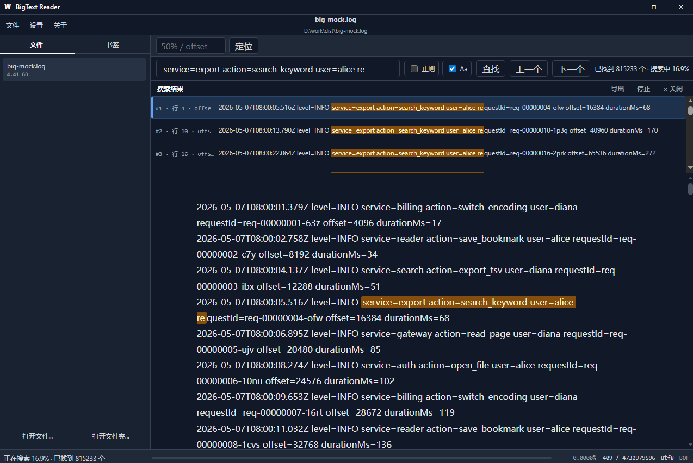
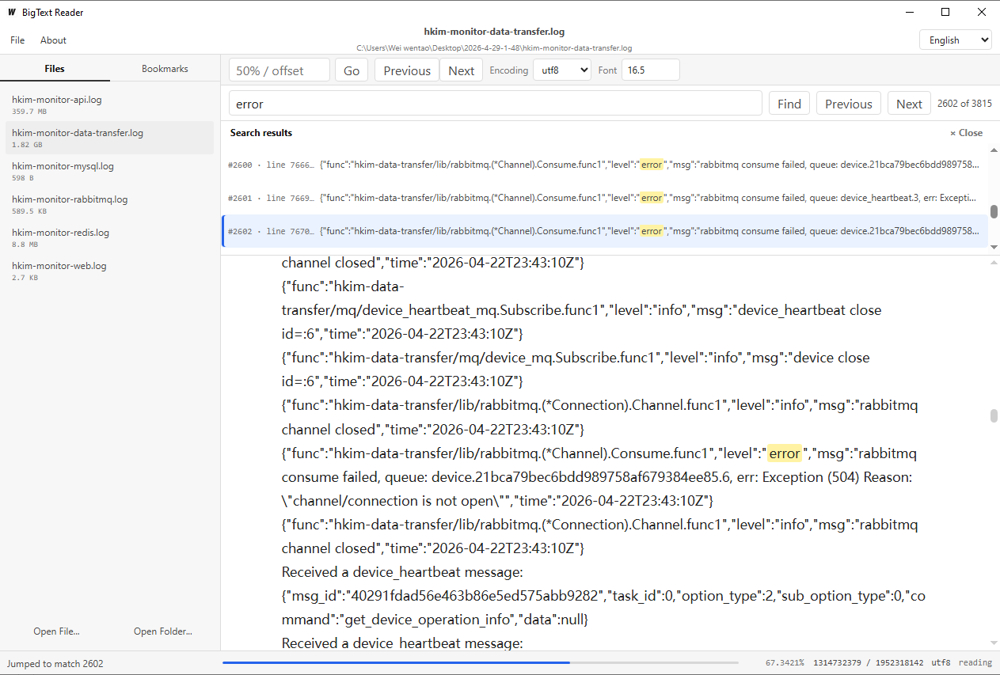
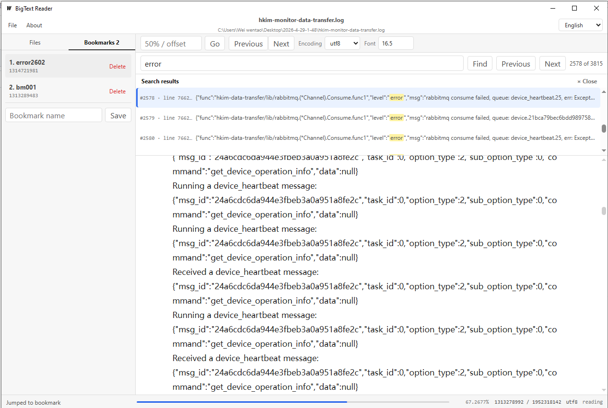

# BigText Reader

English | [简体中文](README.zh-CN.md)

Repository: [github.com/weiwentao996/bigtext-reader](https://github.com/weiwentao996/bigtext-reader)

Latest version: **v1.0.1**


**BigText Reader** is a lightweight desktop reader for very large plain-text files. It is designed for GB-scale `.txt` and `.log` files that are too large for ordinary editors to open smoothly. Instead of loading the whole file into memory, it reads content on demand.

## Keywords

large text file reader, big text reader, huge txt reader, log file reader, GB text file viewer, large log viewer, desktop text reader, Wails text reader, UTF-8 GBK reader, huge text search, plain text viewer

## Features

- **Open huge files smoothly**: read GB-scale TXT / LOG files without loading the whole file into memory.
- **Paging by byte offset**: fast navigation for very large files.
- **Seamless scrolling**: automatically loads previous and next content while reading.
- **UTF-8 and GBK support**: supports UTF-8, GBK, and automatic encoding detection.
- **Full-file search**: search through the whole file and build a lightweight result index.
- **Virtualized search results**: smoothly browse large search result lists without manual pagination.
- **Accurate result jumping**: click a search result and jump to the exact line and match position.
- **Highlight matches**: search hits are highlighted in the reader and preview list.
- **Bookmarks**: save, list, jump to, and delete bookmarks.
- **Reading progress**: automatically remembers the last reading offset for each file.
- **Folder file list**: open a folder and quickly switch between files.
- **Drag-and-drop opening**: drag a text file into the app and open it in the current workspace.
- **Single-instance behavior**: opening a file through Windows routes it to the existing app window instead of creating a duplicate window.
- **Hot encoding switch**: change encoding after opening a file without restarting the app.
- **Adjustable font size**: tune the reading font size for long reading sessions.
- **Internationalization**: built-in Simplified Chinese and English UI.
- **Desktop app**: built with Go + Wails, no browser extension required.

## Use Cases

BigText Reader is useful when you need to:

- Open very large `.txt` novels or exported text archives.
- Inspect huge `.log` files without freezing an editor.
- Search across GB-scale plain-text files.
- Read Chinese text files encoded in GBK.
- Keep reading progress and bookmarks for long files.
- Browse a folder of logs or text files quickly.
- Drag a file into the app without losing the current window layout.

## Screenshots

### Large File Reading

Open and scroll through a GB-scale log file with progress, encoding, and font controls.



### Full-File Search

Search through the whole file, browse virtualized results, and jump to highlighted matches.



### Bookmarks and Search

Save reading positions as bookmarks and combine them with search result navigation.



## Supported Platforms

| Platform | Status | Notes |
| --- | --- | --- |
| Windows 10 / 11 | Supported | Primary target. The release artifact is `bigtext-reader.exe`. |
| macOS | Source build possible | Not packaged or fully tested yet. Wails supports macOS builds. |
| Linux | Source build possible | Not packaged or fully tested yet. Wails supports Linux builds with the required WebKit dependencies. |

BigText Reader is currently developed and tested mainly on Windows. macOS and Linux support are planned for future release builds.

## Installation

Download the latest release from [GitHub Releases](https://github.com/weiwentao996/bigtext-reader/releases):

- Windows: `BigText-Reader-v1.0.1-windows-amd64.zip`

Unzip the package and run `BigText-Reader-v1.0.1-windows-amd64.exe`.

You can also drag a `.txt`, `.log`, or other plain-text file into the app window to open it directly.

If there is no release package yet, build it from source using the steps below.

## Build from Source

### Requirements

- Go 1.22+
- Node.js and npm
- Wails v2.12+ CLI

Install Wails if needed:

```bash
go install github.com/wailsapp/wails/v2/cmd/wails@latest
```

Development mode:

```bash
wails dev
```

Production build:

```bash
wails build
```

The Windows executable will be generated at:

```text
build/bin/bigtext-reader.exe
```

Frontend-only build:

```bash
cd frontend
npm install
npm run build
```

Run tests:

```bash
go test ./...
```

## Tech Stack

- **Go**: backend file reading, encoding, search, persistence.
- **Wails v2**: desktop application shell and Go / JavaScript bridge.
- **Vanilla JavaScript**: frontend UI without heavy framework dependencies.
- **Vite**: frontend development and build tool.

## Project Structure

```text
bigtext-reader/
├── app.go                 # Wails backend API
├── main.go                # Application entry
├── internal/
│   ├── reader/            # Large-file reading, pagination, encoding, search
│   └── state/             # Reading progress and bookmarks persistence
├── frontend/
│   ├── src/main.js        # UI logic and i18n
│   └── src/style.css      # Application styles
├── build/                 # Icons, manifests, generated binaries
└── wails.json             # Wails project config
```

## Data and Compatibility

BigText Reader stores local reading state such as progress, encoding, and bookmarks in the user config directory.

The project was previously named `bf-reader`. Current versions use `bigtext-reader`, while keeping migration compatibility for old local data:

- old app state: `bf-reader` → `bigtext-reader`
- old frontend preferences: `bf-reader.language` / `bf-reader.fontSize` → `bigtext-reader.language` / `bigtext-reader.fontSize`

This compatibility code is intentional so existing users do not lose reading progress or settings after the rename.

## Roadmap

Possible future improvements:

- Dark mode.
- More encodings.
- Regex search.
- Case-sensitive / case-insensitive search options.
- Export search results.
- Installer package for Windows.
- macOS and Linux release builds.

## Contributing

Issues and pull requests are welcome in the [GitHub repository](https://github.com/weiwentao996/bigtext-reader).

If you find a large text file that BigText Reader cannot open smoothly, please open an [issue](https://github.com/weiwentao996/bigtext-reader/issues) with:

- operating system
- file size
- file encoding if known
- what operation was slow or incorrect
- whether the file is TXT, LOG, or another plain-text format

## License

No license has been added yet. If you plan to publish this repository for public use, consider adding an open-source license such as MIT, Apache-2.0, or GPL-3.0.

## Author

Created by **weiwt**.
